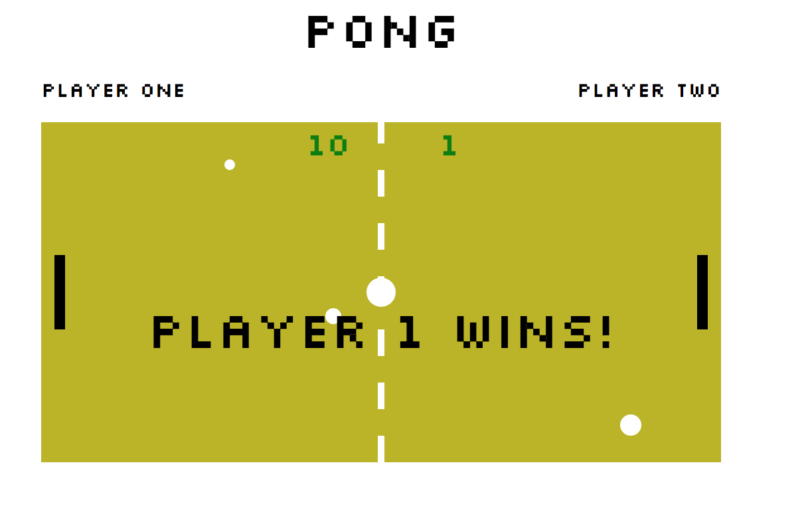

# Pong Game

A basic pong game using SVGs.

# Screenshot

## Setup

**Install dependencies:**

`> npm i`

**Run locally with Webpack Dev Server:**

`> npm start`

**Build for production:**

`> npm run build`

## Keys
* s: shrink paddle
* g: grow paddle
* m: plays music
* 'spacebar': pauses game

**Player 1:**
* a: up
* z: down

**Player 2:**
* ▲ : up
* ▼: down

